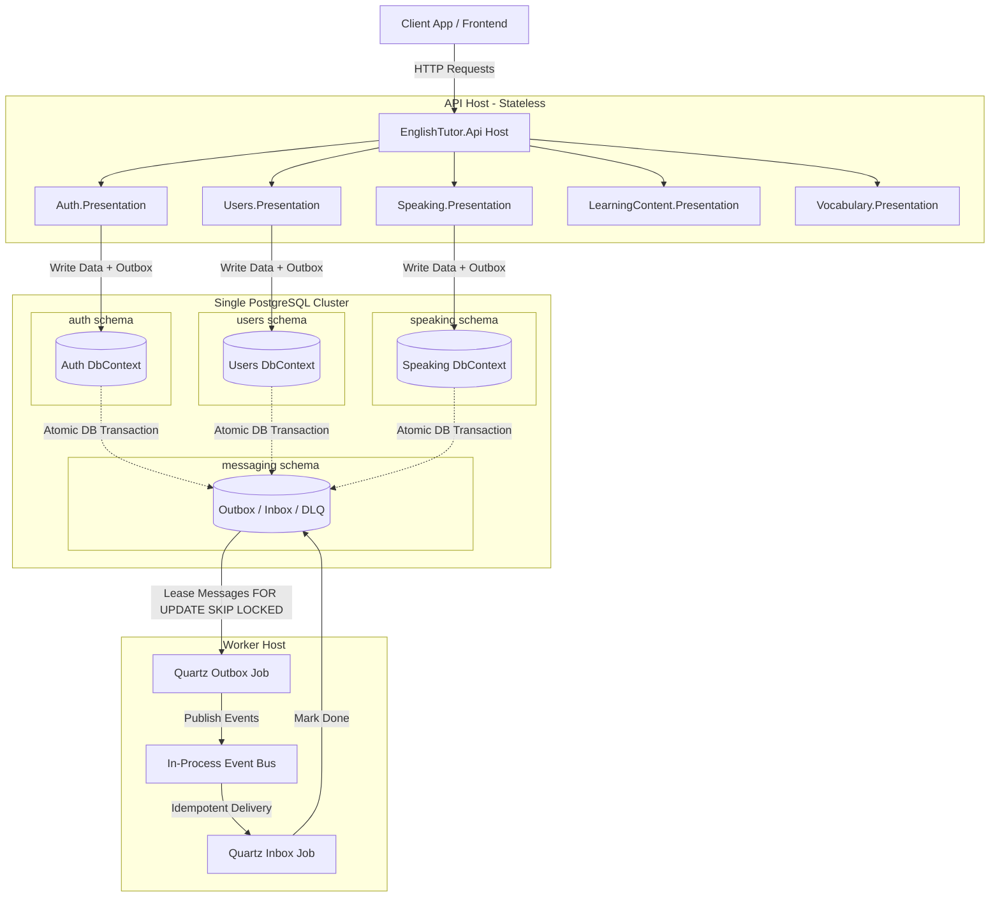

# EnglishTutor Backend 🚀

[](https://dotnet.microsoft.com/en-us/)
[](https://www.postgresql.org/)
[](https://redis.io/)
[](https://learn.microsoft.com/en-us/dotnet/aspire/get-started/aspire-overview)

Welcome to **EnglishTutor**, a production-grade backend SaaS built with a **Modular Monolith** architecture in **.NET 10**. This system is specifically designed to power an AI-assisted English learning platform. It implements clean architecture boundaries, tactical Domain-Driven Design (DDD) patterns, robust outbox/inbox internal messaging, and multi-model AI routing.

---

## 📖 Table of Contents

- [🚀 Architecture Blueprint](#-architecture-blueprint)
- [🛠️ Tech Stack & Centralized Packages](#%EF%B8%8F-tech-stack--centralized-packages)
- [📦 Module Map (13 Bounded Contexts)](#-module-map-13-bounded-contexts)
- [🏗️ Layering & DDD Project Structure](#%EF%B8%8F-layering--ddd-project-structure)
- [⚙️ Setup & Installation](#%EF%B8%8F-setup--installation)
  - [Prerequisites](#prerequisites)
  - [Method A: Quick Start via .NET Aspire (Recommended)](#method-a-quick-start-via-net-aspire-recommended)
  - [Method B: Running via Docker Compose & Core CLI](#method-b-running-via-docker-compose--core-cli)
- [💾 Database & Migration Policy](#-database--migration-policy)
- [🤖 Multi-Model AI Service & Prompts](#-multi-model-ai-service--prompts)
- [📬 Reliable Outbox/Inbox Event Flow](#-reliable-outboxinbox-event-flow)
- [🌐 Multi-Language Learning Core](#-multi-language-learning-core)
- [🧪 Testing Suite](#-testing-suite)
- [📂 Document Directory](#-document-directory)

---

## 🚀 Architecture Blueprint

Instead of separating domain logic into premature microservices—which introduces heavy distributed network overhead, complex transaction boundaries, and operations latency—**EnglishTutor** uses a **Modular Monolith** pattern. This enables strict compile-time boundaries, separate relational schemas, and isolated database contexts while retaining the simplicity of a single runtime deployment.



### Core Architecture Guardrails

1. **Isolation First**: A module must never reference another module's `Domain`, `Application`, `Infrastructure`, or `Presentation` layers. It may **only** reference the target module's `Contracts` assembly.
2. **Database Isolation**: Each module operates its own `DbContext` mapped exclusively to its designated PostgreSQL schema. Direct cross-module joins or foreign keys are forbidden.
3. **No IQueryable Leaking**: `IQueryable` variables are prohibited from crossing module boundaries.
4. **Communication Patterns**: 
   - **Synchronous**: Small, instant cross-module reads are handled using **Contract Readers** (returning DTOs/Read Models).
   - **Asynchronous**: Cross-module state updates are executed via **Integration Events** processed through the **Outbox/Inbox** pattern.
   - **User Screens**: Optimized **Read Models / Projections** are stored directly in the consuming module's schema to build aggregate user screens without querying across modules.

---

## 🛠️ Tech Stack & Centralized Packages

The project uses **Central Package Management (CPM)** to guarantee version consistency across all dependencies. Version metadata is centrally managed in the root directory under [Directory.Packages.props](file:///d:/Projects/EnglishTutor/Directory.Packages.props).

| Tech Component | Framework / Tooling | Package Version / Description |
| :--- | :--- | :--- |
| **Core Runtime** | .NET 10.0 (C# 14) | Targeted `TargetFramework` across all 70+ projects via `Directory.Build.props` |
| **Orchestration** | .NET Aspire 13.3 | Developer-friendly local cloud orchestration (`EnglishTutor.AppHost`) |
| **Database** | PostgreSQL 17 | Partitioned into 14 distinct schemas |
| **EF Core Provider** | EF Core 10 & Npgsql 10 | Object-Relational Mapper & Postgres Driver |
| **Caching & Storage** | Redis 7 & Local / S3 | Distributed Caching via StackExchange.Redis & S3-compatible cloud storage |
| **Mediation / CQRS** | MediatR 14.1 | Simplifies in-process message dispatch and decoupled Command/Query execution |
| **Validation** | FluentValidation 12.1 | Strongly-typed, validation pipelines executed prior to request handler access |
| **Authentication** | JWT Bearer & BCrypt.Net | Cryptographically secure token issuer & BCrypt password hashing |
| **Background Jobs** | Quartz.NET 3.18 | Powers outbox scheduling, email notifications, and automated progress streak decays |
| **Structured Logging**| Serilog 4.3 | Configured to log clean console outputs and JSON files in production |
| **API Documentation**| .NET OpenAPI | Native ASP.NET Core OpenAPI document generation |
| **Testing** | xUnit & NetArchTest | System includes comprehensive domain unit tests and automated architecture rule checks |

---

## 📦 Module Map (13 Bounded Contexts)

The monolith is organized into **13 highly-cohesive modules** categorized by functional domain:

```text
Identity & Profiles
  ├── Auth              - Token generation, login validation, BCrypt hashing, permissions seed.
  └── Users             - User information, profile details, and localized language configurations.

Learning Engine
  ├── LearningContent   - Curriculums, lessons, conversation transcripts, sentence structures.
  ├── Vocabulary        - Flashcards, review attempts, example sentences, and mastery scores.
  ├── Exercises         - Multi-choice, blank-fills, translation, conjugation, and ordering engine.
  ├── Speaking          - Speech runtime, oral conversations, transcripts, and session summaries.
  ├── Mistakes          - Aggregates incorrect user answers for personalized reviews.
  └── Assessments       - Placement exams and level-up tests evaluated by AI rubrics.

Engagement & Analytics
  ├── StudyPlans        - Personalized learning tracks, calendar planners, and study targets.
  ├── Progress          - Streak counts, EXP tallies, weekly skills, and dashboard widgets.
  ├── Notifications     - Outbound study reminders, missed sessions alerts, and emails.
  └── AdminReports      - Multi-schema views and reporting aggregates for analytics.

Intelligence Node
  └── AI                - Client connections, prompt templating, cost calculations, rate-limiting.
```

---

## 🏗️ Layering & DDD Project Structure

Each module implements **Clean Architecture** and tactical **Domain-Driven Design (DDD)** divided into five individual projects.

```text
src/03.Modules/{ModuleName}/
  ├── {ModuleName}.Domain/          - Core entities, value objects, domain exceptions, and business rules.
  ├── {ModuleName}.Application/     - Commands, Queries, Handlers, DTOs, and event publishers.
  ├── {ModuleName}.Infrastructure/  - Module DbContext, EF Configurations, Migrations, and API clients.
  ├── {ModuleName}.Presentation/    - Slim Controllers or Minimal API endpoints delegating to MediatR.
  └── {ModuleName}.Contracts/       - Shared public DTOs, integration events, and Contract Readers.
```

### BBounded Context Directory Hierarchy

To keep domain models clear and maintainable, aggregates are organized into structured directories within the `.Domain` layer:

```text
Domain
└── {AggregateRootName}
    ├── {AggregateRootName}.cs       - Aggregate Root inheriting AggregateRoot<TId> (SoftDeletable)
    ├── Entities/                     - Child Entities inheriting Entity<TId> (Auditable)
    ├── ValueObjects/                 - Immutable Value Objects (e.g., LanguageCode, MasteryScore)
    ├── Enums/                        - Business Enums
    ├── Rules/                        - Specific business invariants inheriting IBusinessRule
    ├── Events/                       - Local Domain Events raised by the aggregate
    └── Services/                     - Pure domain services free of external dependencies (IQueryable, DB)
```

---

## ⚙️ Setup & Installation

Follow these steps to run the complete environment locally on your development system.

### Prerequisites
- **.NET SDK 10.0** or later
- **Docker & Docker Compose** (for local infrastructure)
- **IDE**: Visual Studio 2022, Rider, or VS Code with C# Dev Kit.

### Local Infrastructure

The backend depends on PostgreSQL, RabbitMQ, and Redis. The repository ships
with a `docker-compose.yml` to bring them up locally:

```bash
docker compose up -d
# → englishtutor-postgres (5432), englishtutor-rabbitmq (5672 + UI 15672), englishtutor-redis (6379)
```

After ~10 seconds, the API exposes:
- `/health/live` — process alive (always 200)
- `/health/ready` — Postgres + RabbitMQ + Redis reachable (tag `ready`)
- `/health` — full report

Full guide (port overrides, configuration, troubleshooting, optional Seq):
**[`docs/infrastructure/local-dev.md`](docs/infrastructure/local-dev.md)**

---

### Method A: Quick Start via .NET Aspire (Recommended)

The easiest way to boot the complete environment (PostgreSQL, Redis, API, and background Worker) with automated local orchestration is using **.NET Aspire**.

1. Copy `.env.example` into a local `.env` file to customize environment variables:
   ```bash
   cp .env.example .env
   ```
2. Configure local AppHost secrets:
   ```bash
   dotnet user-secrets set "Parameters:jwt-secret" "replace-with-at-least-32-byte-local-secret" --project src/01.Orchestration/EnglishTutor.AppHost
   dotnet user-secrets set "Parameters:seed-admin-password" "replace-with-local-admin-password" --project src/01.Orchestration/EnglishTutor.AppHost
   ```
3. Run the AppHost bootstrapper directly:
   ```bash
   dotnet run --project src/01.Orchestration/EnglishTutor.AppHost/EnglishTutor.AppHost.csproj
   ```
4. Open the **Aspire Dashboard** at the URI printed in your console log (e.g., `http://localhost:18888`) to view active logs, trace spans, metrics, and manage your API/Worker processes.

---

### Method B: Running via Docker Compose & Core CLI

If you prefer using standard Docker containers and running the .NET projects directly:

1. **Boot Database and Redis Infrastructure**:
   ```bash
   docker compose up -d
   ```
   *This launches PostgreSQL 17, Redis 7, PgAdmin 4 (`http://localhost:5051`), and RedisInsight (`http://localhost:5540`).*

2. **Trigger Database Migrations**:
   Set `Database__AutoMigrate=true` in your `.env` or configuration file to automatically apply migrations on startup, or execute standard EF commands:
   ```bash
   dotnet ef database update --project src/03.Modules/Auth/EnglishTutor.Modules.Auth.Infrastructure --startup-project src/02.Hosts/EnglishTutor.Api
   ```

3. **Launch the API**:
   Configure `Jwt__Secret` in the shell environment or `dotnet user-secrets` first. If `SeedData__Enabled=true`, also configure `SeedData__Admin__Password`.
   ```bash
   dotnet run --project src/02.Hosts/EnglishTutor.Api/EnglishTutor.Api.csproj
   ```
   *The Scalar API reference UI will be available at:* `https://localhost:7159/docs` (or `http://localhost:5091/docs`)

   *The raw OpenAPI contract will be available at:* `https://localhost:7159/openapi/v1.json` (or `http://localhost:5091/openapi/v1.json`)

4. **Launch the Worker Host**:
   ```bash
   dotnet run --project src/02.Hosts/EnglishTutor.Worker/EnglishTutor.Worker.csproj
   ```
   *The background worker processes the outbox and triggers Quartz jobs.*

---

### Seed Credentials
When `SeedData__Enabled=true` is set, a system admin account and default content are automatically seeded on startup.
The admin password is intentionally not committed. Configure it with `SeedData__Admin__Password` through `.env`, user-secrets, Aspire parameters, or your secret manager.

* **Administrator Email:** `admin@englishtutor.local`
* **Wildcard Permission:** `admin.full_access` (Bypasses permission checks)

---

### Resetting a Stale Local Database

If local PostgreSQL was created before recent migrations, startup can fail with missing columns or missing module outbox tables. Reset the local Docker database volume, then restart API/Worker with auto-migration enabled:

```powershell
.\scripts\Reset-DevDatabase.ps1
```

---

## 💾 Database & Migration Policy

To enforce strict modular boundaries, **EnglishTutor** uses a single physical database (`english_tutor_db`) separated into **14 explicit schemas**:

| Schema Name | Target Module / System | Migration Target Assembly |
| :--- | :--- | :--- |
| `auth` | Identity & Permissions | `EnglishTutor.Modules.Auth.Infrastructure` |
| `users` | Localized Settings & Profiles | `EnglishTutor.Modules.Users.Infrastructure` |
| `studyplans` | Study Calendars & Goals | `EnglishTutor.Modules.StudyPlans.Infrastructure` |
| `learningcontent`| Curriculums & Conversations | `EnglishTutor.Modules.LearningContent.Infrastructure` |
| `vocabulary` | Flashcards & Review States | `EnglishTutor.Modules.Vocabulary.Infrastructure` |
| `exercises` | Grammar Drills & Matchers | `EnglishTutor.Modules.Exercises.Infrastructure` |
| `speaking` | Dialog Transcripts & Evaluations | `EnglishTutor.Modules.Speaking.Infrastructure` |
| `ai` | Logging, Costs & Token Counters | `EnglishTutor.Modules.AI.Infrastructure` |
| `mistakes` | System Incorrect Answer Tracker | `EnglishTutor.Modules.Mistakes.Infrastructure` |
| `assessments` | Placements & Grading | `EnglishTutor.Modules.Assessments.Infrastructure` |
| `progress` | EXP Logs & Day Streaks | `EnglishTutor.Modules.Progress.Infrastructure` |
| `notifications` | Queued Communications | `EnglishTutor.Modules.Notifications.Infrastructure` |
| `adminreports` | Business Reporting | `EnglishTutor.Modules.AdminReports.Infrastructure` |
| `messaging` | Outbox, Inbox, and Dead-Letter | Shared Database Context Abstraction |

### Generating a New Migration
When making changes to entities in a specific module (e.g. `Vocabulary`), execute the migration CLI from the root workspace directory, pointing specifically to the infrastructure assembly:
```bash
dotnet ef migrations add AddVocabularyMasteryTable --project src/03.Modules/Vocabulary/EnglishTutor.Modules.Vocabulary.Infrastructure --startup-project src/02.Hosts/EnglishTutor.Api --output-dir Migrations --context VocabularyDbContext
```

---

## 🤖 Multi-Model AI Service & Prompts

Other modules are prohibited from making direct HTTP calls to Gemini, OpenAI, or DeepSeek. Instead, the **AI Module** operates as the centralized intelligence provider.

```text
Speaking / Assessments / Exercises ──( Uses AI.Contracts )──> AI Module ( Central Routing & Auditing )
                                                                   ├── Prompts & Versions
                                                                   ├── Model Routing (Gemini/OpenAI/DeepSeek)
                                                                   └── Cost Log & Rate-Limits
```

### Key AI Implementation Principles:
* **Centralized Clients**: Clients are defined exclusively in `AI.Infrastructure`. Prompt templates, version controls, and model routing are isolated within the `AI` module.
* **Audit & Logs**: The AI module intercepts all prompt submissions to calculate token usage, estimate API costs, and enforce request rate-limits.
* **Context Payload**: Every prompt evaluation payload passed into the AI contract includes native language, target language, and current proficiency levels (e.g., Native: `vi`, Target: `en`, Level: `B2`).

---

## 📬 Reliable Outbox/Inbox Event Flow

To maintain high responsiveness and prevent distributed transaction failures, the system uses the **Transactional Outbox & Inbox** pattern.

```text
[ API Host ]
Command Request
  └── 1. Mutate Domain State
  └── 2. Generate Domain Event
  └── 3. Convert to IntegrationEvent
  └── 4. Write Entity Data + OutboxMessage ──( Single DB Transaction )
  └── 5. Return HTTP 200 (Success)

[ Worker Host ]
Outbox Processor (Quartz Background Job)
  └── 1. Read OutboxMessages (FOR UPDATE SKIP LOCKED)
  └── 2. Publish IntegrationEvent to EventBus
  └── 3. Update Outbox Status to 'Processed'

[ Consumer Modules ]
Inbox Handler (Quartz Deduplication)
  └── 1. Intercept IntegrationEvent
  └── 2. Check messaging.InboxMessages for Idempotency
  └── 3. Process Business Mutation if safe
  └── 4. Commit to Inbox & Mark 'Success'
```

### Core Messaging Principles:
* **Stateless API Host**: API instances are completely stateless and do not dispatch integration events directly to external queues from in-memory request threads.
* **At-Least-Once Delivery**: Events are reliably stored in PostgreSQL before dispatch.
* **Leasing Mechanism**: Worker background threads lease outbox messages using row-locking (`FOR UPDATE SKIP LOCKED`) to ensure horizontal scaling safety.
* **Idempotent Handlers**: Every event consumer checks the `Inbox` to prevent double-processing.

---

## 🌐 Multi-Language Learning Core

The application is explicitly designed to handle multi-language configurations without using multi-tenancy databases. Instead, language variables are tracked at the user preference, content, and progress boundaries.

### Localized Variables
- **NativeLanguageCode**: The learner's native language (e.g., `vi` for Vietnamese). Used for vocabulary translations and contextual explanations.
- **UiLanguageCode**: The language used for application menus and UI elements (e.g., `en`).
- **ExplanationLanguageCode**: The target language for grammar explanations (e.g., `vi` or `en`).
- **ActiveTargetLanguageCode**: The language the user is actively practicing (e.g., `en`).

### Progress Mapping
A user's learning progress, masteries, streak, and mistakes are explicitly scoped by the combined composite key:
`UserId` + `TargetLanguageCode`

---

## 🧪 Testing Suite

The codebase features comprehensive automated tests to ensure code quality and protect module boundaries.

### 1. Architecture Tests
To prevent developers from accidentally breaking module boundaries (e.g., referencing Speaking Domain from the Users Module), the system runs automated architecture tests using **NetArchTest**:
```bash
dotnet test tests/EnglishTutor.ArchitectureTests
```

### 2. Domain & Application Unit Tests
Run standard unit tests targeting isolated domain models, aggregate roots, command handlers, and business validation rules:
```bash
dotnet test
```

---

## 📂 Document Directory

Deep dive into the system blueprints, protocols, and workflows using the structured documents folder:

* 📋 **APIs Contracts**: Detailed HTTP methods, parameters, payloads, and validation rules inside [docs/api/](file:///d:/Projects/EnglishTutor/docs/api/).
* 🔄 **Core Workflows**: Interactive multi-module workflows, including speaking runtimes, flashcard processes, and progress dashboards inside [docs/workflows/](file:///d:/Projects/EnglishTutor/docs/workflows/).
* 📢 **Integration Events**: Listing of all published events and side-effects across the modular monolith inside [docs/events/](file:///d:/Projects/EnglishTutor/docs/events/).
* ⚖️ **Architectural Decisions (ADRs)**: Technical records explaining the modular choices, Outbox/Inbox models, and database design inside [docs/adr/](file:///d:/Projects/EnglishTutor/docs/adr/).
